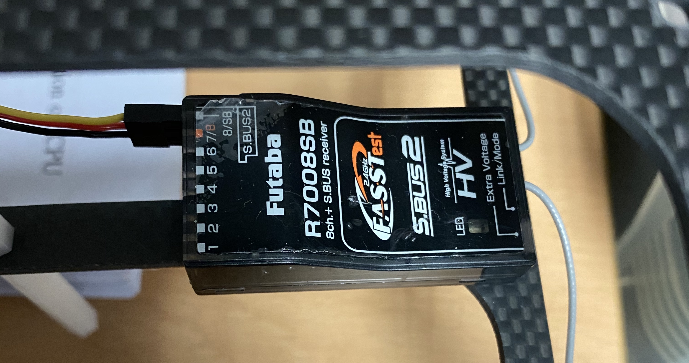

# Pixhawk & Pixraccer setup

## Refernece sites
 + https://dev.px4.io/v1.9.0/en/setup/getting_started.html
 + https://docs.qgroundcontrol.com/en/

## QGroundControl
 ### Download and install QGroundControl (in Ubuntu)
  1. make setting
  ~~~
    sudo usermod -a -G dialout $USER
    sudo apt-get remove modemmanager -y
    sudo apt install gstreamer1.0-plugins-bad gstreamer1.0-libav -y
  ~~~
  2. Logout and login again
  3. Download Image file : https://s3-us-west-2.amazonaws.com/qgroundcontrol/latest/QGroundControl.AppImage
  4. Install
  ~~~
    chmod +x ./QGroundControl.AppImage
    ./QGroundControl.AppImage
  ~~~
## Run QGroundControl
  1. Download or upgrade Firmware
  2. Setup the Airframe
  3. Radio setup
  4. Sensor setup(calibration)
  5. Set Flight Modes
  6. Set power
  7. Parameters

### ESC calibration with Futaba controller

 If the drone is not operate well after all setting process, the reason might be from wrong calibrate ESC.  
 This method is for each ESC calibrate one by one.  
 Using Futaba controller, ESC can calibrated.  
 
    1. connect recevier - controller
    2. connect ESC data pin to the recevier no.3 channel.
    3. pull up the throttle leaver, then pull down the leaver and wait seconds to end calibrate.
 
  
