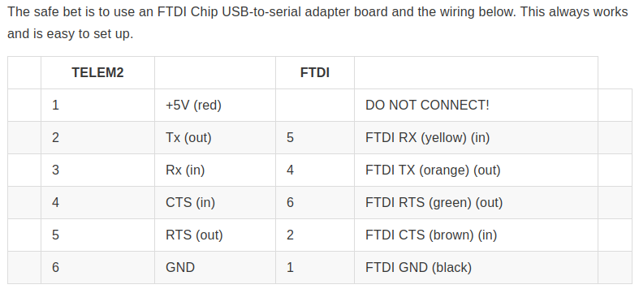
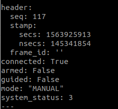

# Pixhawk - NUC(PC) setting

### Reference site : https://dev.px4.io/v1.9.0/en/ros/mavros_installation.html

## Environment
    NUC : Ubuntu 18.04, ROS melodic
    Pixhawk : 1.8.2v
    HW : FTDI serial-to-USB Cable
  
## Install Mavros in NUC(PC)
    sudo apt-get update
    sudo apt-get install ros-melodic-mavros ros-melodic-mavros-extras
    wget https://raw.githubusercontent.com/mavlink/mavros/master/mavros/scripts/install_geographiclib_datasets.sh
    ./install_geographiclib_datasets.sh
    cd ~/catkin_ws
    catkin_make
    source devel/setup.bash
    
## Connect serial-to-USB Cable
   ** MCU_TX => board RX,MCU_RX => board TX 
 
  
## Pixhawk configuration
   lauch Qgroundcontrol
   
    Parameter -> SYS_COMPANION -> select Companion Link(921600 baudrate 8N1)
   reboot the vehicle
   
## Run
    ## permission problem
    sudo chmod 777 /dev/ttyUSB0 (or /dev/ttyACM0)
    
    ## launch programs
    roscore
    rosrun mavros mavros_node _fcu_url:="/dev/ttyUSB0:921600"
    
    ## rostopic check
    rostopic echo /mavros/state -c
    rostopic echo /mavros/imu/data -c
    
## Result
  /mavros/state topic
  
  
    
    

